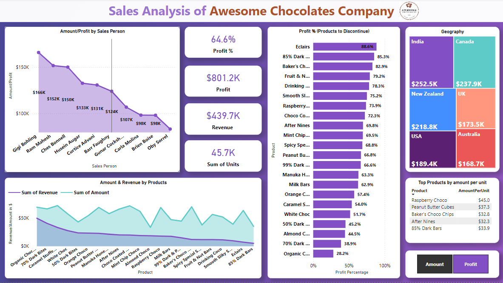
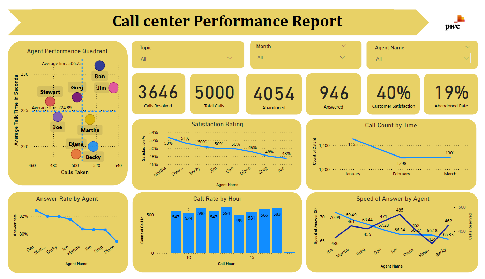

# [Rejeesh's Github Profile](https://github.com/rejeeshravindran)
 
# [Awesome Chocolates Company Sales Analysis Project](https://github.com/rejeeshravindran/Awesome_Chocolate_Company.git)

The Dataset used is from the company 'Awesome Chocolates'
The data contains informations about the sales of their product in different countries.
The Problem statement is to find insights about the sales of the products. 

The data is first loaded in Excel and explored. Then it was imported to SQL (SQL Server) 
Cleaning and modeling & EDA of the data is done seperately in Excel, SQL  & Power BI.

## Dashboard using Power BI

The Dataset used is from the company ‘Awesome Chocolates’ The data contains information’s about the sales of their product in different countries. The Problem statement is to find insights about the sales of the products. The data is first loaded in Excel and explored. Then it was imported to SQL (SQL Server) Cleaning and modeling & EDA of the data is done separately in Excel, SQL & Power BI.

1, This dashboard helps the viewer to understand whether the amount goes below revenue. 

2, Top 5 products with the highest dollar per- amount are also shown. 

3, The dashboard also tells the sales generated according to each salesperson, custom measure is also added to switch 4, between- Profit and Amount with country as filter.

5, We can also easily understand which are the products to discontinue, Product by profit percentage graph helps- to highlight the products with negative profit values.

# [Call Center Performance Analysis project](https://github.com/rejeeshravindran/Call-Center-Performance-Report.git)

The Data set used is from the internship project of PWC - Call Center Data , First Data is analyzed In Excel and it is Imported to Power BI then Modeled to create the required reports.

## Visualization of the Insights 

Actionable Insights

Jim - Highest call taker
Dan - Highest average talk duration
Dan-  Highest Answer Rate
Martha - Highest customer Satisfaction Rating

1, There is high call reduction starting from February month.

2, Agent Performance Quadrant helps us to understand the Agents who went above or below average Talk time and call count.

3, Call Rate/Hour graph in the given time period helps us to understand the peak hours so we can advise the agents to not take breaks, In case if agents have assigned breaks we must ensure that the work load should be properly allocated to others for handling the peak hours.

4, Technical support has high abandoned rate.

5, We are having slightly high abandoned calls for technical support topics. we must always ensure the abandoned calls details must be pulled out everyday and should call back the customer.

6, Martha has high satisfaction rating and those agents should be praised and we also need to study their approach to train others in improving the services.
7, Agents with talk time above average should undergo training also agents with high abandoned rate, high speed of answer and low satisfaction rate should strictly be monitored.

