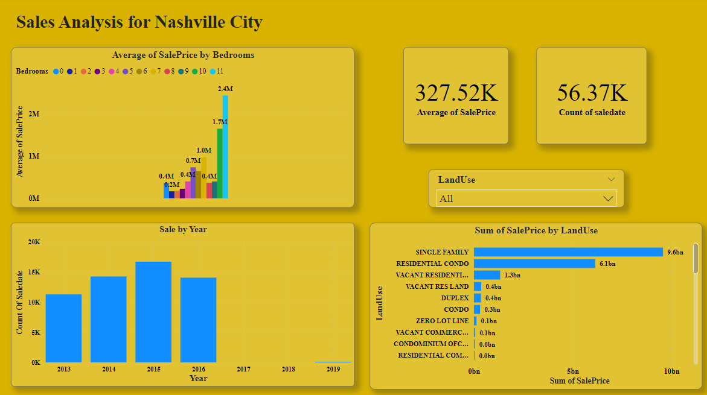

# [My Profile:](https://github.com/rejeeshravindran)
 
# Rejeesh Portfolio   

# [Accenture-Socialmedia-project](https://github.com/rejeeshravindran/Accenture-Socialmedia-project)

The client Social Buzz is a Social media & content creation firm. Accenture has started a POC on below, 
An audit of their big data practice , Recommendations for a successful IPO , The problem statement is an analysis of their content categories that highlights the top 5 categories with the largest aggregate popularity 

The 3 datasets given is cleaned and merged and modeled into a single dataset. The process is done on both Microsoft Excel and SQL. After the data is cleaned and modeled it is loaded to Microsoft PowerBI for visualisation & presentation of the insights. 
## Visualization of the Insights 

## Insights
The top 5 categories were Animals, Science, Healthy eating, Technology & Food these items have the highest reaction counts and reaction scores. Animals have the highest reaction score and followed by others.
Food comes at 5th based on the reaction score criteria, But it comes 4th by the total number of count by reactions.
The major category in the top 5 is food.

## Summary & conclusion 

If the company is able to focus more contents on the top 5 items listed. It can increase the user activity on the platform.
As per the top 5 category, It seems that users are looking for real life contents. So we suggest to add more unique contents on the same. 
We can see that January and May have more reactions and engagement. Therefore, we advise to integrate more advertisements in these months to gain an advantage, 
since there is higher user activity on these specific months, You can increase advertsing costs. 
In the top 5 category there is healthy eating and food, One suggestion is to collaborate with a healthy eating brand to 
do campaigns which may increase revenue. Thank you.

# [Nashville_Housing_Project](https://github.com/rejeeshravindran/Nashville_Housing_Project)
The Data used is Nashville Housing collected from https://www.kaggle.com/datasets/tmthyjames/nashville-housing-data
The data contains informations about the housing of Nashville city in USA. 
The Problem statement is to find insights about the sales of the Housing. 

While exploring the data for the first time, It contains mainly informations related to house/plot of customers.
The data is first loaded in Excel and explored. Then it was imported to SQL (SSMS) 
Cleaning and modeling of the data is thoroughly explained with comments in the SQL File 
After the data is cleaned and modeled it is loaded to Microsoft PowerBI from SQL Server Database for visualisation & presentation of the insights.

## Visualization of the Findings

## Sales Analysis of Nashville City 

1,The average selling price for the housing is higher for the building with more bedrooms.

2,In the 7 years from 2013 to 2019 we can see that in 2015 got higher sales.
 ( note: 2017 & 2018 datas are missing from the raw file)
 
3, Single Family houses are the most sold(9.6 BN), Residential Condos are the second most sold(6.1 BN)

4, Single Family houses produced the highest revenue.

5, Vacant Commercial Land and Zero Lot Line have generated least revenue. 

## Summary & conclusion 

Considering the given data, By finding the concerned Sales people for the year 2015 and giving
them raise and better commission may increase sales.
We need to invest more in the Single family houses & Residential condos to generate more revenue.
Vacant Commercial Land & Zero Lot Line can be last to considered while investing.

