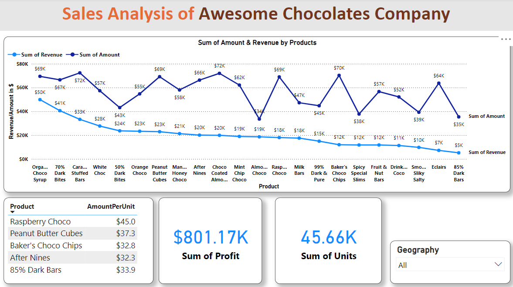
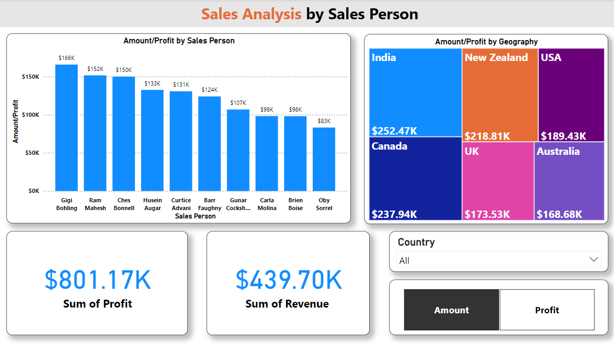
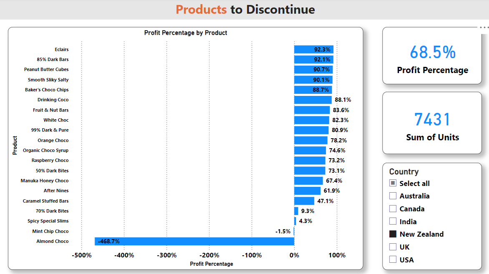
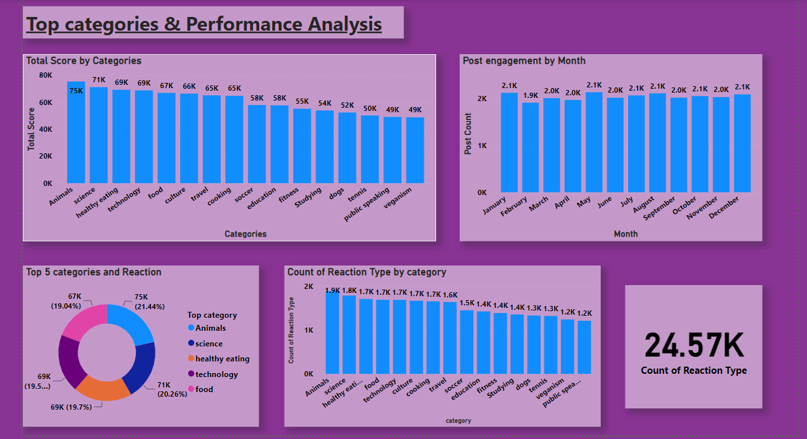

# [Rejeesh's-Github-Profile](https://github.com/rejeeshravindran)
 
# [Awesome-Chocolates-Company-Sales-Analysis-Project](https://github.com/rejeeshravindran/Awesome_Chocolate_Company.git)

The Dataset used is from the company Awesome Chocolates
The data contains informations about the sales of their product in different countries.
The Problem statement is to find insights about the sales of the products. 

The data is first loaded in Excel and explored. Then it was imported to SQL (SQL Server) 
Cleaning and modeling & EDA of the data is done seperately in Excel, SQL  & Power BI.

## Visualization of the Findings using Power BI

The dashboard helps the viewer to understand whether amount goes below revenue. Top 5 products with the highest dollar per-
amount is also shown. Used countries as filter.

The dashboard tells the sales generated according to each sales person, custom measure is also added to switch between-
Profit and Amount with country as filter.

This dashboard shows the products to discontinue, Product by profit percentage graph with a country filter helps-
to highlight the product with negative profits.

# [Accenture-Socialmedia-project](https://github.com/rejeeshravindran/Accenture-Socialmedia-project)

The client Social Buzz is a Social media & content creation firm. Accenture has started a POC on below, 
An audit of their big data practice , Recommendations for a successful IPO , The problem statement is an analysis of their content categories that highlights the top 5 categories with the largest aggregate popularity 

The 3 datasets given is cleaned and merged and modeled into a single dataset. The process is done on both Microsoft Excel and SQL. After the data is cleaned and modeled it is loaded to Microsoft PowerBI for visualisation & presentation of the insights. 
## Visualization of the Insights 

## Insights
The top 5 categories were Animals, Science, Healthy eating, Technology & Food these items have the highest reaction counts and reaction scores. Animals have the highest reaction score and followed by others.
Food comes at 5th based on the reaction score criteria, But it comes 4th by the total number of count by reactions.
The major category in the top 5 is food.

## Summary & conclusion 

If the company is able to focus more contents on the top 5 items listed. It can increase the user activity on the platform.
As per the top 5 category, It seems that users are looking for real life contents. So we suggest to add more unique contents on the same. 
We can see that January and May have more reactions and engagement. Therefore, we advise to integrate more advertisements in these months to gain an advantage, 
since there is higher user activity on these specific months, You can increase advertsing costs. 
In the top 5 category there is healthy eating and food, One suggestion is to collaborate with a healthy eating brand to 
do campaigns which may increase revenue. Thank you.

